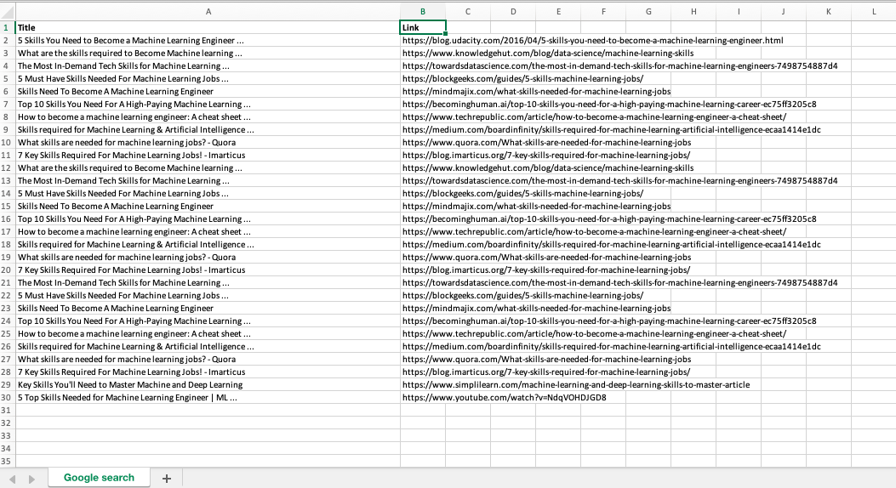

# Google crawler
In this project, I scraped several Google pages to get the title and link in the search results. I then imported the results in an Excel file.  

Python Libraries: requests, BeautifulSoup, openpyxl  

Below is the Excel file obtain for "Machine learning skills" (over 3 pages).  

 
